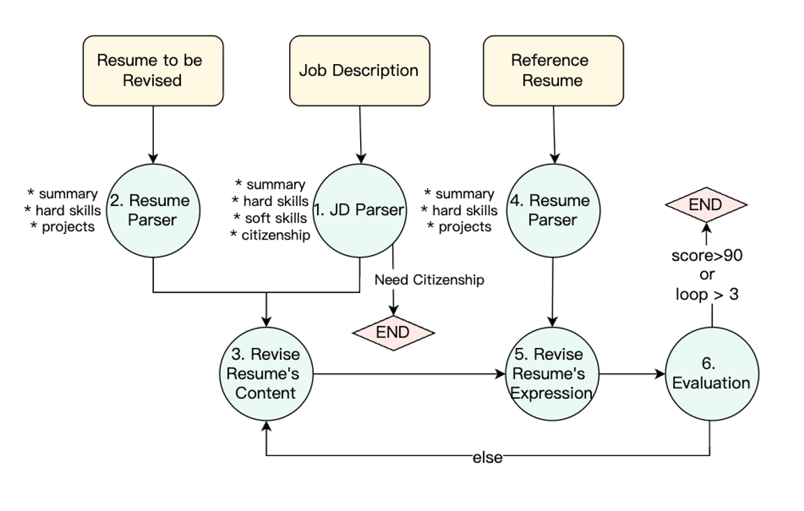

# Resume Revise Agent
Resume Revise Agent is an AI-powered tool designed to help job seekers improve their resumes by analyzing, evaluating, and revising resume content and expression based on job descriptions and high-quality reference resumes.



## Features
- **Automatic Resume Parsing:** Converts resumes (PDF, DOCX, Markdown) to structured markdown format.
- **Job Description Analysis:** Extracts key requirements and skills from job postings.
- **Content & Expression Evaluation:** Scores resumes for content relevance and expression quality using AI agents.
- **Iterative Revision:** Automatically revises resumes up to n times to maximize scores.
- **Reference Resume Comparison:** Uses a high-quality reference resume to guide improvements.
- **Rich Console Output:** Progress and results are displayed with clear status updates.

## How It Works
1. **Input:** Provide your target resume, a job description URL, and a reference resume.
2. **Parsing:** The system converts and parses the resumes and job description.
3. **Evaluation:** AI agents score your resume for content and expression.
4. **Revision:** The resume is revised iteratively until it meets quality thresholds.
5. **Output:** The final revised resume and scores are presented.

## Usage
1. Place your resume and reference resume in the project directory.
2. Run the main script and follow the prompts to input file paths and job description URL.
3. View the revised resume and evaluation report in the console.

## Requirements
- Python 3.12+
- [python-docx](https://pypi.org/project/python-docx/)
- [rich](https://pypi.org/project/rich/)
- [py-zerox](https://pypi.org/project/py-zerox/)
- [selenium](https://pypi.org/project/selenium/)
- OpenAI API key (for agent models)

Install dependencies:
```bash
pip install -r requirements.txt
```

## Project Structure
- `main.py` — Entry point for running the agent
- `manager.py` — Main logic for resume improvement
- `helper_agents/` — Contains agent modules for parsing, revising, and evaluating
- `printer.py` — Rich console output
- `requirements.txt` — Python dependencies
- `converted_resume/` — Stores converted markdown resumes

## License
MIT

## Contact
For questions or feedback, open an issue or contact the maintainer.